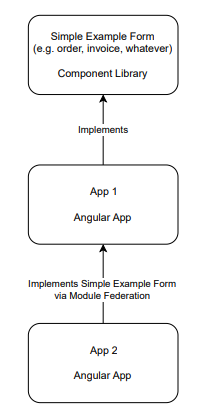

## Zadání
Vytvořte ukázkový formulář libovolného obsahu jako komponentu v knihovně. (např. faktura, objednávka, atd. Složitost formuláře a počet polí není důležitý  !!!)
Následně vytvořte dvě aplikace:
1. První aplikace bude implementovat formulář z knihovny.
2. Druhá aplikace bude pomocí modulové federace vkládat formulář z první aplikace.
Nastudujte a vysvětlete jak se obecně chovají styly, které mají aplikace použité. Např. pokud styl v knihovně nebude odpovídat verzi stylu v cílové aplikace přes modulovou federaci.

Vytvořte závěrečné shrnutí problematiky modulové federace formou SWOT.
### Podmínky
• Nehodnotíme obsah výsledné aplikace, ale klíčový je princip, struktura kódu, pochopení a odprezentování problematiky.
• Použití Angularu ve verzi 14, anebo vyšší

### Obrázek

